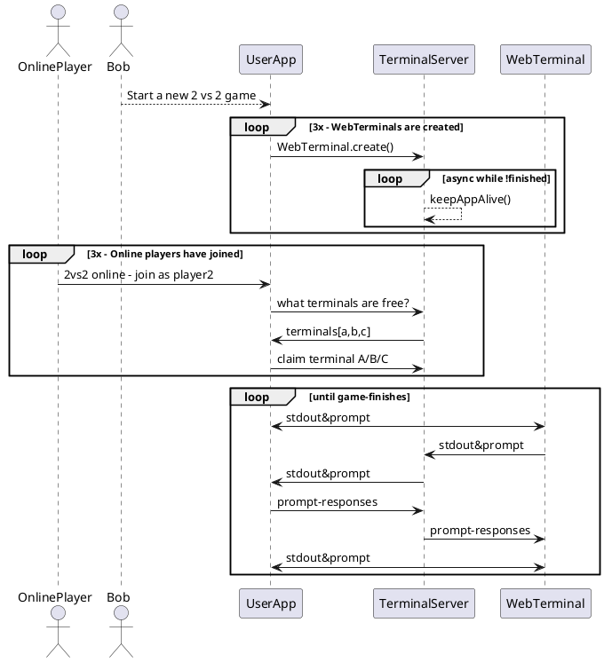
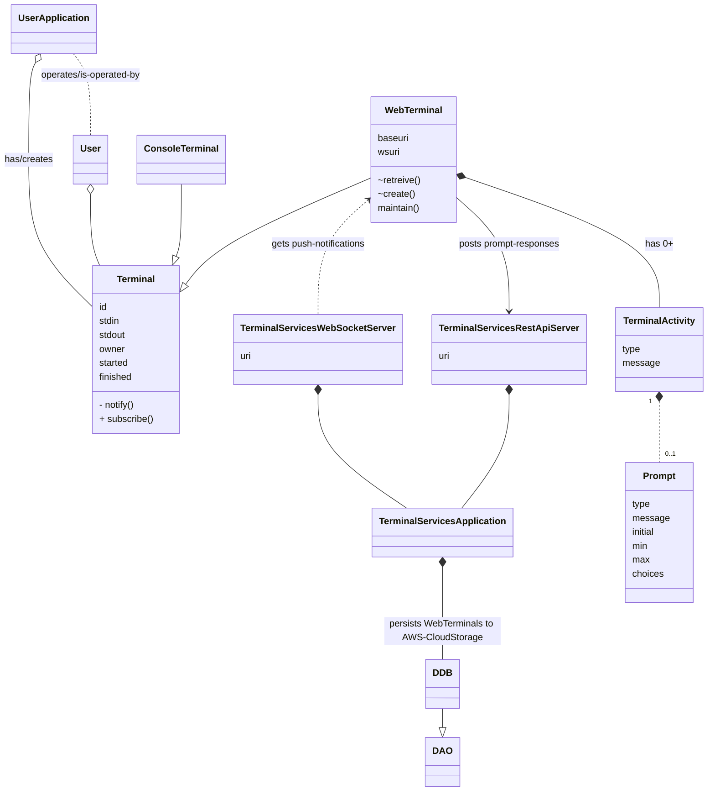

> 2021-07-12 : Software Development : Terminal Communications : Hawryschuk, Alexander

# Terminal Services
This package provides abstract classes for terminals to be used in a software application for one or more users in one or more places to use the software in tandem.

A terminal is a standad-communication device for input and output, and an application interfaces with one or more users through terminals. Terminals may be interfaced through CLI, through GUI, and remotely through REST-API and WebSockets working with the application and users together.

An example is Bob playing a card game with three other friends. Bob launches bob.com/cardgame, starts a new game with three online-terminals for his freinds. Bobs friends visit the site, join his game, and play the game through. This all happened through the shared-memory of the two-party WebTerminal interface abstraction.

User Stories:
- As a developer, I want to write applications that faciliate remote [user] interaction
  - Terminal-Services server that maintains WebTerminals (RESTAPI)
     - STDOUT : Write to WebTerminal
     - STDIN  : Prompt for input and wait for a response
- As a user, I want to interface with an application through standard-communication protocols (STDIN/STDOUT)
  - Connect to the terminal ( console, gui-widgets, rest-api )
  - Maintain the connection with updates
  - Respond to prompts

