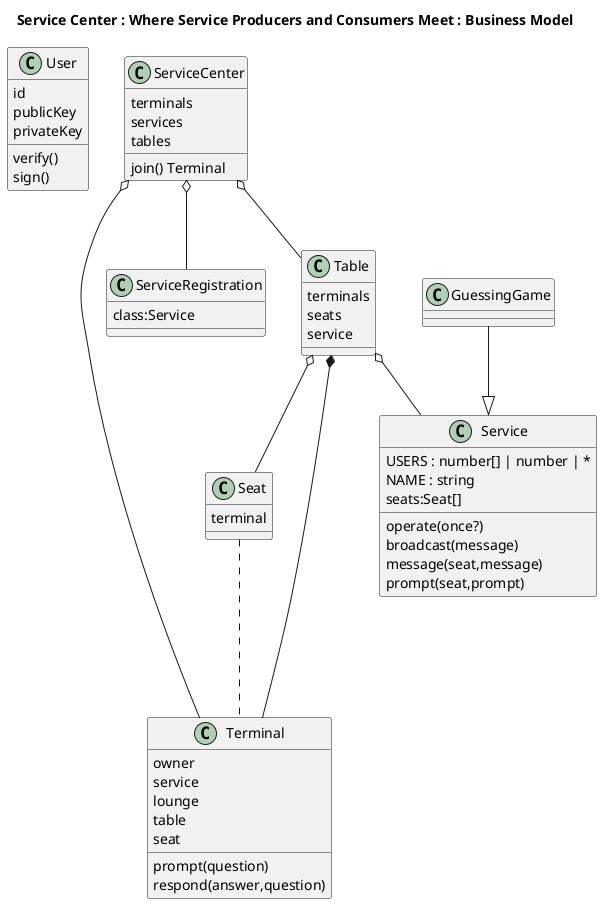
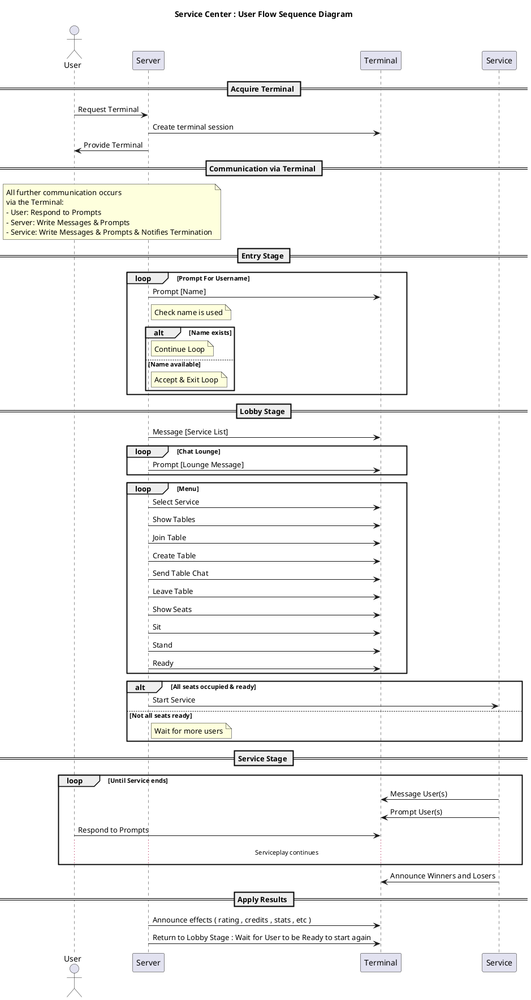

> 2021-07-12 : Software Development : Terminal Communications : Hawryschuk, Alexander
> 2025-08-25 : Refactoring of Terminal[Console|Web] and Rewrite of Terminal Server and Service Center

# Terminal Services
This package provides abstract classes for terminals to be used in a software application as a communication layer between the producer and consumer of services.

* Terminals provide a means of sending/receiving messages and sending/responding-to queries.

An example is as follows: A Service called "Guessing Game" generates a random number between 1 and 10. It then prompts the players to guess a number between 1 and 10. It determines which player is closest, and announces the winner.

### TODO : 
- Restore functionality :
    - Table Chat
    - Invite Robot
    - Boot Robot
    - Stand
    - Switch Service
    - Exit
    - Error handling
        - user goes offline
        - error in service
    - Remote Service Center
    - CLI
- User from @hawryschuk-crypto
    - sign activity
- Migrate to @hawryschuk-crypto/Server
